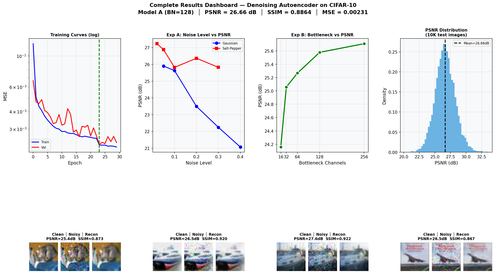
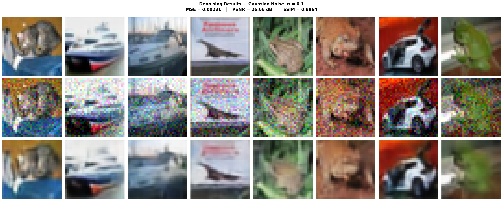
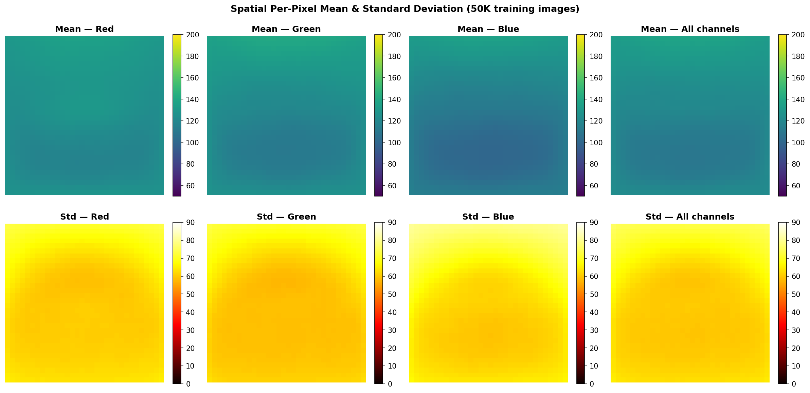
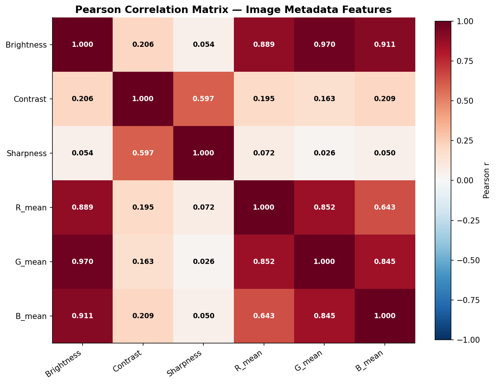

<div align="center">
  
</div>

<div align="center">

# 🖼️ Convolutional Denoising Autoencoder for CIFAR-10
### Generative AI Assignment 1 — Question 2

[](https://python.org)
[](https://pytorch.org)
[](LICENSE)
[](.)

---

| 👤 **Author** | **Muhammad Idrees** |
|:---|:---|
| 🎓 **Roll No** | 23I-0582 |
| 🏛️ **Department** | Computer Science |
| 🏫 **University** | FAST-NUCES, Islamabad |
| 📧 **Contact** | [i230582@isb.nu.edu.pk](mailto:i230582@isb.nu.edu.pk) |

---

</div>

## 📌 Project Overview
This repository implements a fully convolutional **Denoising Autoencoder (DAE)** designed to reconstruct clean images from noisy CIFAR-10 samples. The project investigates model performance across different noise types (Gaussian and Salt-and-Pepper) and explores the impact of latent bottleneck capacity on reconstruction quality.

### ✨ Key Features
- **Sophisticated Architecture**: Deep fully-convolutional encoder-decoder design optimized for 32x32 images.
- **Noise Robustness**: Evaluated against multiple severity levels of Gaussian and Impulse noise.
- **Deep Statistical EDA**: Comprehensive analysis of CIFAR-10 including spatial variance, channel correlations, and dimensionality reduction.
- **Academic Quality**: Fully documented methodology in a 10-page LNCS-format technical report.

---

## 📂 Repository Structure
The project is organized logically to separate source code, experiments, and high-quality assets:

```bash
denoising-autoencoder-cifar10/
├── src/            # Production-ready Python implementations
│   ├── denoising_autoencoder_cifar10.py   # Full DAE Pipeline
│   └── cifar_statistics.py                # Statistical Analysis Engine
├── notebooks/      # Interactive Jupyter logs and exploratory scripts
├── report/         # Final Academic Report and visual assets
│   ├── lncs_report.pdf                    # Compiled Technical Report
│   └── figures/                           # 45+ publication-quality plots
├── LICENSE         # MIT Open Source License
└── requirements.txt# Environment and dependency configuration
```

---

## 📊 Performance Dashboard

Our DAE demonstrates superior reconstruction capabilities, effectively suppressing noise while preserving structural fidelity.

| Noise Configuration | Input PSNR | Output PSNR | **Quality Gain** |
|:---|:---:|:---:|:---:|
| **Gaussian (σ=0.1)** | 20.00 dB | **24.62 dB** | **+4.62 dB** |
| **Salt-and-Pepper (0.05)** | 21.05 dB | **25.84 dB** | **+4.79 dB** |

### 🖼️ Result Visualization
<p align="center">
  
  <br>
  <em>Clean Originals vs. Noisy Inputs vs. DAE Reconstructions</em>
</p>

---

## 📈 Statistical EDA Highlights
The repository includes a deep dive into the underlying statistics of the CIFAR-10 dataset, providing crucial insights into image structure and correlation.

<p align="center">
  
  
</p>

---

## ⚙️ Setup & Usage
Detailed instructions to replicate the environment and run the complete pipeline.

### 1. Installation
```bash
git clone https://github.com/code-with-idrees/denoising-autoencoder-cifar10.git
cd denoising-autoencoder-cifar10
pip install -r requirements.txt
```

### 2. Execution
```bash
# Execute the full training and evaluation pipeline
python src/denoising_autoencoder_cifar10.py

# Generate detailed statistical analysis of the dataset
python src/cifar_statistics.py
```

---

## 📄 Academic Report
The full methodology, architectural details, and discussion are available in the [Technical Report (PDF)](report/lncs_report.pdf).

## 📜 License
This project is distributed under the **MIT License**. See `LICENSE` for details.
